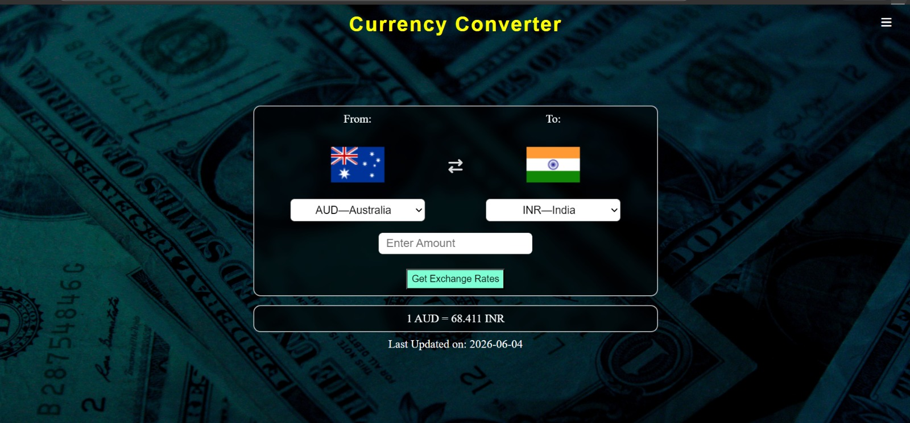

# 💱 Currency Converter Web App

A modern and responsive currency conversion application built with **HTML, CSS, and JavaScript** that provides real-time exchange rates using external APIs. The application focuses on delivering a smooth user experience through persistent settings, theme customization, conversion history, offline awareness, and mobile-friendly interactions.

---

## 🚀 Live Demo

**🔗 Website:**  
https://namanjainb3-tech.github.io/currency_converter/

---

## 📸 Preview



---

## ✨ Features

### 💱 Real-Time Currency Conversion

- Live exchange rates via Frankfurter API
- Automatic conversion updates
- Formatted currency output
- Exchange rate information display

### 🔁 Smart Currency Management

- Dynamic currency selection
- One-click currency swap
- Automatic flag updates
- Default currency persistence

### 🌗 Theme Customization

- Light Mode
- Dark Mode
- Persistent theme settings using LocalStorage

### 🕘 Conversion History

- Stores latest conversions
- Persists across browser sessions
- Clear history functionality
- Prevents duplicate history spam

### 📡 Network Awareness

- Detects offline state
- Disables API-dependent actions
- Displays user-friendly network messages
- Automatically restores functionality when online

### 📱 Responsive Design

- Mobile-first layout
- Tablet compatibility
- Desktop optimization
- Adaptive UI components

---

## 🧠 User Flow

### 1️⃣ Launch Application

Users are greeted with a clean interface and default currency selections.

### 2️⃣ Select Currencies

Choose source and target currencies from dropdown menus.

### 3️⃣ Enter Amount

Input the desired amount to convert.

### 4️⃣ Fetch Exchange Rate

The application requests real-time rates from the Frankfurter API.

### 5️⃣ View Results

Users receive:

- Converted amount
- Exchange rate
- Latest update information

---

## ⚙️ Technical Highlights

### Debounced Input Handling

Prevents excessive API requests while typing and improves overall application performance.

### Local Storage Integration

Stores:

- Theme preferences
- Currency selections
- Default currencies
- Conversion history

### Offline Support

The application intelligently responds to connectivity changes and prevents failed API requests.

### Error Management

Handles:

- Invalid inputs
- API failures
- Network interruptions
- Unsupported conversions

without breaking the user experience.

---

## 🛠️ Technology Stack

| Technology | Purpose |
|------------|----------|
| HTML5 | Structure & Layout |
| CSS3 | Styling & Responsive Design |
| JavaScript (ES6+) | Application Logic |
| Frankfurter API | Real-Time Exchange Rates |
| Flags API | Country Flag Rendering |
| LocalStorage | Persistent User Data |

---

## 📂 Project Structure

```text
currency_converter/
│
├── assets/
│   ├── images/
│   │   ├── dark.jpg
│   │   ├── light.jpg
│   │   └── icon.jpg
│
├── screenshots/
│   └── homepage.png
│
├── js/
│   └── currency_converter.js
│
├── css/
│   └── style.css
│
├── index.html
├── README.md
└── LICENSE
```

---

## 🔐 Data Persistence

The application stores user preferences locally using browser LocalStorage.

### Stored Information

```text
✓ Theme Preference
✓ Last Selected Currencies
✓ Default Currency Pair
✓ Conversion History
```

No user information is transmitted or stored externally.

---

## ⚙️ Installation & Usage

### Clone the Repository

```bash
git clone https://github.com/namanjainb3-tech/currency_converter.git
cd currency_converter
```

### Run Locally

Simply open:

```text
index.html
```

in your preferred browser.

No additional setup or dependencies are required.

---

## 📈 Learning Outcomes

This project helped strengthen understanding of:

- API Integration
- Asynchronous JavaScript
- DOM Manipulation
- Local Storage
- Event Handling
- Responsive Design
- Error Handling
- User Experience Design

---

## 🔮 Future Enhancements

- Searchable currency dropdown
- Historical exchange-rate charts
- Progressive Web App (PWA)
- Multi-currency comparison
- Export conversion history
- Favorite currency pairs
- Currency trend visualization

---

## 👨‍💻 Author

### Naman Jain

Computer Science Engineering Student  
IIIT Sonepat

Interested in:

- Frontend Development
- Artificial Intelligence
- System Design
- Full Stack Development

---

## 📜 License

This project is licensed under the MIT License.

---

## ⭐ Support

If you found this project useful, consider giving the repository a **Star ⭐**.

Your support encourages further development and open-source contributions.
